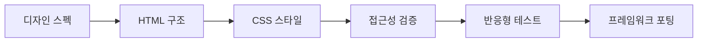

# BRICKS Design System - 프로젝트 가이드

## 📋 목차
1. [프로젝트 개요](#프로젝트-개요)
2. [설계 원칙](#설계-원칙)
3. [기술 방법론](#기술-방법론)
4. [개발 로드맵](#개발-로드맵)
5. [벤치마킹 전략](#벤치마킹-전략)
6. [프레임워크 통합 계획](#프레임워크-통합-계획)

---

## 프로젝트 개요

### 🎯 비전
BRICKS는 "벽돌"처럼 견고하고 재사용 가능한 컴포넌트를 조립하여 인터페이스를 구축하는 모듈식 디자인 시스템입니다.

### 🔑 핵심 가치
- **Simplicity**: 텍스트 기반의 미니멀한 디자인
- **Accessibility**: WCAG 2.1 AA 준수
- **Modularity**: 컴포넌트 기반 아키텍처
- **Flexibility**: 다양한 프레임워크 지원
- **Performance**: 최적화된 CSS 구조

---

## 설계 원칙

### 1. CSS 코딩 컨벤션

#### 1.1 한 줄 작성 규칙 (Single-Line CSS)
```css
/* ❌ Bad - 여러 줄로 작성 */
.button {
  display: flex;
  align-items: center;
  padding: 8px 16px;
}

/* ✅ Good - 한 줄로 작성하여 상속 관계 명확히 */
.button {display:flex; align-items:center; padding:8px 16px;}
.button--primary {background:var(--color-primary); color:#fff;}
.button--primary:hover {background:var(--color-primary-dark);}
```

#### 1.2 상속 구조 표현
```css
/* 부모 → 자식 → 손자 순서로 들여쓰기 없이 나열 */
.card {background:#fff; border:1px solid #e0e0e0; border-radius:8px;}
.card__header {padding:16px; border-bottom:1px solid #e0e0e0;}
.card__header-title {font-size:18px; font-weight:600;}
.card__body {padding:16px;}
.card__footer {padding:16px; border-top:1px solid #e0e0e0;}
```

#### 1.3 BEM 네이밍 컨벤션
- Block: `.card`, `.button`, `.nav`
- Element: `.card__header`, `.button__icon`
- Modifier: `.card--featured`, `.button--large`

### 2. 웹 접근성 원칙

#### 2.1 WCAG 2.1 AA 준수 체크리스트
- [ ] **색상 대비**: 일반 텍스트 4.5:1, 큰 텍스트 3:1
- [ ] **키보드 접근성**: 모든 인터랙티브 요소 Tab 접근 가능
- [ ] **포커스 표시**: 명확한 포커스 인디케이터
- [ ] **스크린 리더**: ARIA 레이블 및 랜드마크 제공
- [ ] **폼 접근성**: 레이블 연결, 에러 메시지 제공
- [ ] **반응형**: 최소 320px 지원

#### 2.2 필수 ARIA 속성
```html
<!-- 버튼 -->
<button aria-label="메뉴 열기" aria-expanded="false">

<!-- 모달 -->
<div role="dialog" aria-modal="true" aria-labelledby="modal-title">

<!-- 네비게이션 -->
<nav aria-label="주 메뉴">

<!-- 로딩 상태 -->
<div aria-live="polite" aria-busy="true">
```

### 3. 디자인 토큰 체계

#### 3.1 네이밍 규칙
```css
:root {
  /* Primitive Tokens - 원시 값 */
  --color-blue-50: #e3f2fd;
  --color-blue-500: #2196f3;
  --color-blue-900: #0d47a1;
  
  /* Semantic Tokens - 의미 기반 */
  --color-primary: var(--color-blue-500);
  --color-text-primary: var(--color-gray-900);
  --color-bg-surface: var(--color-white);
  
  /* Component Tokens - 컴포넌트 전용 */
  --button-height-sm: 32px;
  --button-height-md: 40px;
  --button-radius: 6px;
}
```

---

## 기술 방법론

### 1. 컴포넌트 개발 프로세스



### 2. 파일 구조 전략

```
bricks/
├── core/                  # 핵심 시스템
│   ├── tokens/           # 디자인 토큰
│   │   ├── colors.css
│   │   ├── typography.css
│   │   ├── spacing.css
│   │   └── index.css
│   ├── base/             # 기본 스타일
│   │   ├── reset.css
│   │   ├── utilities.css
│   │   └── index.css
│   └── themes/           # 테마
│       ├── light.css
│       └── dark.css
├── components/           # 컴포넌트
│   ├── atoms/           # 원자 컴포넌트
│   │   ├── button/
│   │   ├── input/
│   │   └── badge/
│   ├── molecules/       # 분자 컴포넌트
│   │   ├── card/
│   │   ├── form-group/
│   │   └── dropdown/
│   └── organisms/       # 유기체 컴포넌트
│       ├── header/
│       ├── sidebar/
│       └── modal/
├── patterns/            # UI 패턴
│   ├── forms/
│   ├── tables/
│   └── navigation/
└── frameworks/          # 프레임워크별 구현
    ├── vanilla/
    ├── react/
    └── nextjs/
```

---

## 개발 로드맵

### Phase 1: Foundation (Week 1-2)
- [x] 프로젝트 구조 설계
- [x] 디자인 토큰 시스템 구축
- [x] 기본 레이아웃 구현
- [x] 다크모드 지원
- [ ] CSS 코딩 컨벤션 적용
- [ ] 웹 접근성 기본 구현

### Phase 2: Core Components (Week 3-4)
- [ ] **Atoms 개발**
  - [ ] Button (기본, 아이콘, 로딩 상태)
  - [ ] Input (텍스트, 체크박스, 라디오)
  - [ ] Badge, Label, Tag
  - [ ] Icon System
- [ ] **Molecules 개발**
  - [ ] Card
  - [ ] Form Group
  - [ ] Dropdown
  - [ ] Alert

### Phase 3: Complex Components (Week 5-6)
- [ ] **Organisms 개발**
  - [ ] Navigation (GNB, LNB, Breadcrumb)
  - [ ] Modal & Dialog
  - [ ] Table (정렬, 필터, 페이지네이션)
  - [ ] Tab System
- [ ] **Patterns 구축**
  - [ ] Form Layouts
  - [ ] Grid System
  - [ ] List Views

### Phase 4: Framework Integration (Week 7-8)
- [ ] **React 컴포넌트 변환**
  - [ ] Props Interface 정의
  - [ ] Hooks 개발 (useTheme, useModal)
  - [ ] Storybook 구축
- [ ] **Next.js 최적화**
  - [ ] CSS Modules 적용
  - [ ] Dynamic Import
  - [ ] SSR/SSG 지원

### Phase 5: Documentation & Testing (Week 9-10)
- [ ] 컴포넌트 문서화
- [ ] 사용 가이드 작성
- [ ] 접근성 테스트
- [ ] 성능 최적화
- [ ] 배포 준비

---

## 벤치마킹 전략

### 참고 디자인 시스템

| 시스템 | 특징 | 적용 포인트 |
|--------|------|-------------|
| **Hope UI** | Bootstrap 5 기반, 다양한 대시보드 템플릿 | 컴포넌트 구조, SCSS 토큰 체계 |
| **Tabler** | 관리자 대시보드 특화, 깔끔한 UI | 데이터 테이블, 폼 패턴 |
| **MDB UI Kit** | Material Design 구현 | 애니메이션, 인터랙션 패턴 |
| **Pixel Bootstrap** | 섹션 기반 레이아웃 | 랜딩 페이지 컴포넌트 |
| **Boomerang UI** | 모듈식 구조 | 컴포넌트 조합 방식 |

### 벤치마킹 체크리스트
- [ ] 컴포넌트 구조 분석
- [ ] CSS 아키텍처 연구
- [ ] 접근성 구현 방식
- [ ] 반응형 브레이크포인트
- [ ] 테마 시스템
- [ ] 문서화 방식

---

## 프레임워크 통합 계획

### 1. Vanilla JavaScript
```javascript
// bricks.js - 순수 JS 구현
class BricksButton {
  constructor(element, options) {
    this.element = element;
    this.options = { ...defaultOptions, ...options };
    this.init();
  }
  
  init() {
    this.bindEvents();
    this.applyStyles();
  }
}
```

### 2. React 컴포넌트
```jsx
// Button.jsx
import { forwardRef } from 'react';
import styles from './Button.module.css';

const Button = forwardRef(({ 
  variant = 'primary',
  size = 'md',
  children,
  ...props 
}, ref) => {
  const className = `
    ${styles.button}
    ${styles[`button--${variant}`]}
    ${styles[`button--${size}`]}
  `.trim();
  
  return (
    <button ref={ref} className={className} {...props}>
      {children}
    </button>
  );
});

Button.displayName = 'Button';
export default Button;
```

### 3. Next.js 최적화
```jsx
// next.config.js
module.exports = {
  sassOptions: {
    includePaths: ['./styles'],
  },
  experimental: {
    optimizeCss: true,
  },
};

// _app.js
import '@bricks/core/tokens';
import '@bricks/core/base';
import { ThemeProvider } from '@bricks/react';

function MyApp({ Component, pageProps }) {
  return (
    <ThemeProvider>
      <Component {...pageProps} />
    </ThemeProvider>
  );
}
```

### 4. CSS-in-JS 지원 (선택사항)
```javascript
// styled-components 버전
import styled from 'styled-components';
import { tokens } from '@bricks/tokens';

const StyledButton = styled.button`
  height: ${tokens.button.height.md};
  padding: 0 ${tokens.space[4]};
  background: ${props => props.primary ? tokens.color.primary : tokens.color.secondary};
  border-radius: ${tokens.radius.md};
`;
```

---

## 품질 보증

### 테스트 전략
1. **유닛 테스트**: Jest + React Testing Library
2. **시각적 회귀 테스트**: Chromatic
3. **접근성 테스트**: axe-core, Pa11y
4. **성능 테스트**: Lighthouse CI
5. **브라우저 호환성**: BrowserStack

### 지원 브라우저
- Chrome (최신 2개 버전)
- Firefox (최신 2개 버전)
- Safari (최신 2개 버전)
- Edge (최신 2개 버전)
- iOS Safari 14+
- Chrome Android 100+

---

## 배포 및 버전 관리

### NPM 패키지 구조
```json
{
  "name": "@bricks/design-system",
  "version": "1.0.0",
  "exports": {
    ".": {
      "import": "./dist/index.esm.js",
      "require": "./dist/index.cjs.js"
    },
    "./css": "./dist/bricks.css",
    "./react": "./dist/react/index.js",
    "./nextjs": "./dist/nextjs/index.js"
  }
}
```

### 버전 관리 정책
- **Major**: Breaking changes
- **Minor**: 새 기능 추가
- **Patch**: 버그 수정

---

## 참고 자료

### 필수 읽기
- [WCAG 2.1 Guidelines](https://www.w3.org/WAI/WCAG21/quickref/)
- [BEM Methodology](http://getbem.com/)
- [Design Tokens W3C](https://www.w3.org/community/design-tokens/)

### 도구
- [Contrast Checker](https://webaim.org/resources/contrastchecker/)
- [WAVE Accessibility Tool](https://wave.webaim.org/)
- [Storybook](https://storybook.js.org/)

### 영감
- [Material Design](https://material.io/)
- [Ant Design](https://ant.design/)
- [Carbon Design System](https://carbondesignsystem.com/)

---

## 참조

https://tairo.cssninja.io/dashboards
---

*Last Updated: 2025.01.11*


  아직 생성되지 않은 페이지들:
  - Elements: checkbox, radio, toggle, avatar, progress, spinner
  - Components: alert, card, modal, dropdown, tabs, accordion, pagination, breadcrumb, navbar, table
  - Layout: grid, container, flexbox
  - Utilities: display, position, overflow